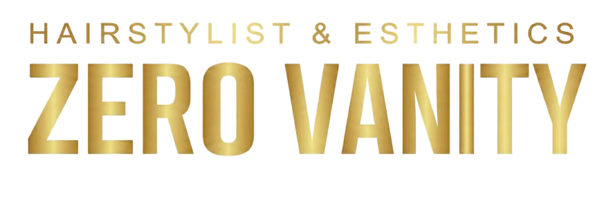

# 💎 Zero Vanity | Luxury Salon Platform



> *Donde la estética de vanguardia se une al lujo atemporal.*

[](https://reactjs.org/)
[](https://vitejs.dev/)
[](https://tailwindcss.com/)
[](https://www.typescriptlang.org/)
[](https://github.com/zerocodedevops/ZeroVanity)

---

## 📖 Descripción

**Zero Vanity** es una plataforma web de alto rendimiento diseñada para salones de belleza de élite. Fusiona un diseño visual impactante con una arquitectura técnica robusta para ofrecer una experiencia de usuario premium desde el primer clic.

Este proyecto se centra en la **velocidad**, la **estética** y la **funcionalidad**, eliminando cualquier fricción entre el cliente y su próxima cita.

## ✨ Características Principales

### 🎨 Experiencia Visual (Frontend)
- **Diseño Luxury Dark-Mode**: Interfaz sofisticada con paleta de colores dorado/negro.
- **Micro-interacciones Fluidas**: Animaciones con `framer-motion` para una navegación suave.
- **Galería Dinámica**: Showcase de estilos con imágenes generadas por IA de alta fidelidad.
- **Responsive 100%**: Adaptación perfecta a móviles, tablets y escritorio.

### ⚡ Rendimiento & Tecnología
- **Optimización WebP**: Todos los activos visuales (imágenes de servicios, equipo, logos) optimizados para carga instantánea.
- **Vite Powered**: Tiempos de arranque y Hot Module Replacement (HMR) ultrarrápidos.
- **Type-Safe**: Base de código robusta en TypeScript.

## 🛠️ Stack Tecnológico

| Capa | Tecnología |
|Data | Propósito |
|---|---|---|
| **Core** | React 18 | Biblioteca de UI componente-céntrica |
| **Build** | Vite | Bundler de última generación |
| **Estilos** | Tailwind CSS | Utility-first CSS framework |
| **Lenguaje** | TypeScript | Tipado estático para robustez |
| **Iconos** | Lucide React | Iconografía moderna y ligera |
| **Animación** | Framer Motion | Biblioteca de animación declarativa |

## 🚀 Instalación y Despliegue

### Requisitos Previos
- Node.js 18+
- npm o yarn

### Pasos
1.  **Clonar el repositorio**
    ```bash
    git clone https://github.com/zerocodedevops/ZeroVanity.git
    cd ZeroVanity
    ```

2.  **Instalar dependencias**
    ```bash
    npm install
    ```

3.  **Iniciar servidor de desarrollo**
    ```bash
    npm run dev
    ```
    Visita `http://localhost:5173` para ver la aplicación.

4.  **Construir para producción**
    ```bash
    npm run build
    ```

## 📸 Capturas de Pantalla

| Landing Page | Servicios |
|---|---|
|  |  |

## 🤝 Contribución

Las contribuciones son bienvenidas. Por favor, abre un issue primero para discutir lo que te gustaría cambiar.

---

<p align="center">
  Hecho con ❤️ por <a href="https://github.com/zerocodedevops">ZeroCode DevOps</a>
</p>
